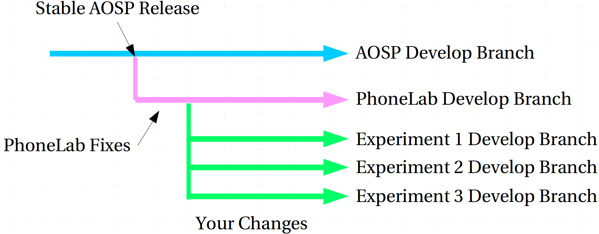

PhoneLab Branch Philosophy
==========================

Before you go ahead and make changes to PhoneLab platform, we recommend you to
at least read this page to get some idea on these two question:

 1. Where is my experiment branch based on?

 2. How will my changes be merged?

This diagram shows how we manage branches for our platform at high level. You
can find more details next.

    PhoneLab Platform Branching Diagram.

PhoneLab Develop Branch
-----------------------

When there is a major release of Android, we usually wait some time for it to be
become mature enough. Then we choose a fairly stable release for our device
(Nexus 5) and create our develop branch from there. The branch name is
``phonelab/android-$tag/develop``, where ``$tag`` is the AOSP release tag.  For
instance, we used the release ``4.4.4_r1`` for KitKat, and used ``5.1.1_r3`` for
Lollipop. To give you some context, a full list of source code tags and builds
can be found `here <https://source.android.com/source/build-numbers.html>`_.

Our develop branch usually only contains device specific changes to make the
platform fully functional, including GPS, cellular---parts there are usually
broken in original AOSP platform. The develop branch serves as a common ground
and does not contain any instrumentations or experiment specific changes.

Experiment Branches
-------------------

To support parallel development of multiple experiments, we create a branch for
each experiment on top of our PhoneLab develop branch. The experiment branch
name is in the format of ``experiment/android-$tag/$id/$name``:

 1. ``$tag`` is the base AOSP release tag that our PhoneLab develop branch is
    based on, for instance, ``5.1.1_r3``.

 2. ``$id`` is an integer that uniquely identifies your experiment.

 3. ``$name`` is a code name for your experiment, which is determined by you.

By default, your experiment branch is not publicly available: only PhoneLab
administrators and yourself have full access to the branch.

Deployment
----------

When we deploy your experiment, we will create a release branch from our
PhoneLab develop branch, and merge your experiment branch into that release
branch.

Since we may continue development on our develop branch AFTER we create the
experiment branch for you, **it is your responsibility to make sure that the
merging finishes smoothly without conflicts.** You can ensure this by trying to
merge our develop branch into your experiment to resolve any conflicts
beforehand, so that the merging on our part is just a fast-forward.

.. warning::
    If your experiment branch can not be merged into our release branch, it will
    be excluded from the release.

